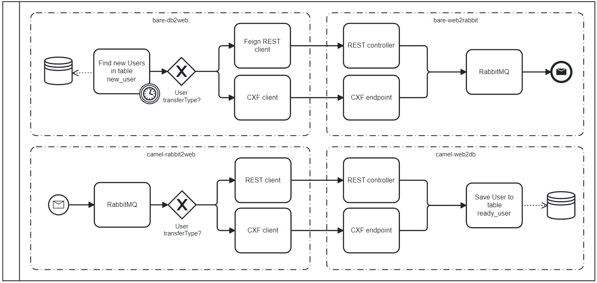

# user-flow-cluster

## Workflow

## Technological stack for services:
Spring Cloud + Spring Admin + Spring Cloud Config  
H2 database?
swagger ?
`eureka-server`:
- ...

`api-gateway`:
- ...

`bare-db2web`:
- SOAP producer
- Feign REST client

`bare-web2active`:
- SOAP consumer

`camel-active2web`:
- Camel

`camel-web2db`:
- Camel